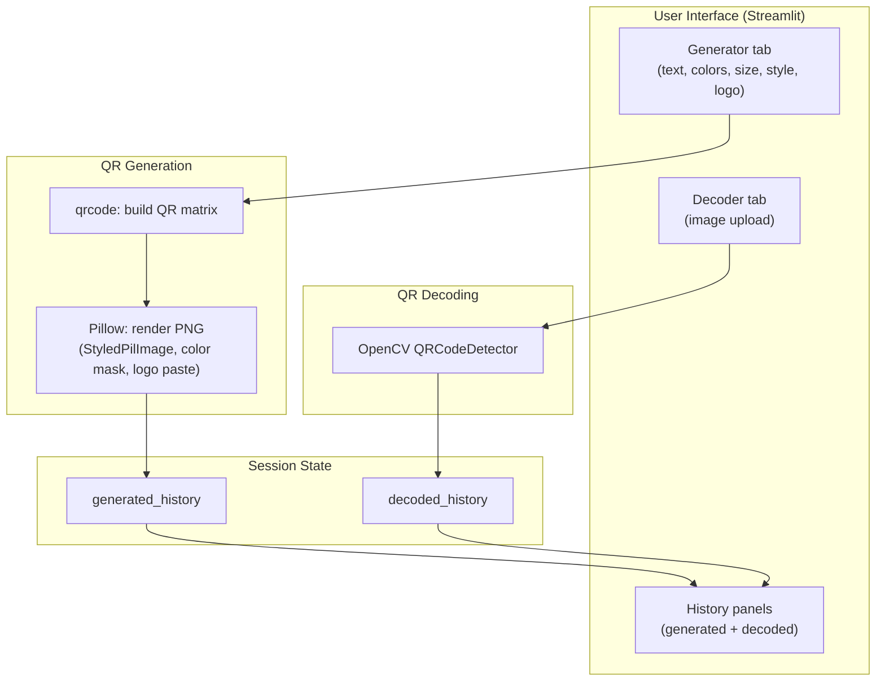

# QR Code Generator / Decoder

A Streamlit app to generate styled QR codes and decode them from uploaded images.

## Features

**Generator tab**
- Encode any text or URL into a QR code
- Pick foreground and background colors with a color picker
- Choose from three module styles: Classic Squares, Rounded, or Circles
- Four size presets: Small, Medium, Large, HD
- Optionally embed a logo image at the center
- Download the result as a PNG
- Session history of every code generated, each with its own download button

**Decoder tab**
- Upload a QR code image (PNG or JPG) to extract its content
- Detects and decodes using OpenCV's built-in QR detector
- If the decoded text is a URL, a one-click "Open Link" button appears
- Session history of decoded results, deduped by content

## System Architecture



### Components

**User Interface (Streamlit)**
- Generator tab: form with text input, color pickers, size/style selectors, optional logo uploader, and a submit button.
- Decoder tab: file uploader that accepts PNG/JPG and runs detection immediately on upload.
- History panels: expandable entries for each generated or decoded item, with download and link buttons where applicable.

**QR Generation**
- `qrcode`: builds the QR matrix from input text, auto-sizing version and using `ERROR_CORRECT_H` for logo compatibility.
- `Pillow` + `StyledPilImage`: renders the matrix with the chosen module drawer (RoundedModuleDrawer, CircleModuleDrawer) and a `SolidFillColorMask` for custom colors. The logo is composited into the center after rendering.

**QR Decoding**
- `cv2.QRCodeDetector`: takes the uploaded image, converts it from RGB to BGR, and runs `detectAndDecode`. Falls back to an error message if detection fails.

**Session State**
- `generated_history`: list of dicts, each holding the encoded text and PNG bytes.
- `decoded_history`: list of dicts with the source filename and decoded text. Duplicate consecutive results are skipped.

### Data Flow

**Generating:**
1. User fills the form and submits.
2. `qrcode.QRCode` builds the matrix; the chosen module drawer renders it via `StyledPilImage`.
3. If a logo is uploaded, it's resized to 1/5 of the QR width and pasted at the center.
4. The final image is encoded to PNG bytes and written to `generated_history`.
5. Streamlit re-renders the preview, download button, and history section.

**Decoding:**
1. User uploads an image.
2. The image is converted to a NumPy array and then to BGR for OpenCV.
3. `QRCodeDetector.detectAndDecode` returns the decoded string (or empty string on failure).
4. The result is displayed; if it's a URL, a link button is shown. The result is appended to `decoded_history` if it differs from the last entry.

## Setup

```bash
pip install -r requirements.txt
```

## Run

```bash
streamlit run app.py
```

Opens at `http://localhost:8501` by default.

## Notes

- History lives in `st.session_state` and resets when the app restarts or the browser session ends. For persistence across restarts, back it with a database or file store.
- `ERROR_CORRECT_H` is used so the QR code stays scannable even with a logo covering part of the center.
- If the foreground and background colors are identical, the app warns you before generating.
- OpenCV's detector works well on clean, high-contrast images. Blurry or heavily compressed photos may fail to decode.