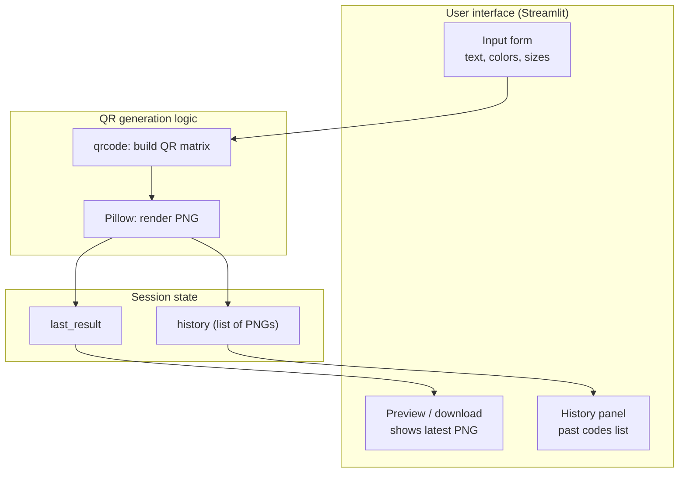

# QR Code Generator

A simple Streamlit app to generate custom QR codes, preview them, download as PNG, and browse your generation history.

## Features

- Generate a QR code from any text or URL
- Customize foreground and background colors
- Adjustable box size and border
- Download the generated QR code as a PNG
- Session history of all codes generated, each individually downloadable

## System Architecture



### Components

**User interface (Streamlit)**
- Input form: collects the text/URL to encode, foreground/background colors, box size, and border size.
- Preview / download: displays the most recently generated QR code and offers a PNG download button.
- History panel: lists every QR code generated this session, each with its own download button.

**QR generation logic**
- `qrcode`: builds the QR matrix from the input text, auto-sizing to fit the data.
- `Pillow`: renders that matrix into a PNG image using the chosen colors, then encodes it to bytes.

**Session state**
- `last_result`: holds the most recently generated PNG bytes plus its metadata, shown in the preview section.
- `history`: a list that accumulates every generated PNG (and its settings/timestamp) for the duration of the session.

### Data flow

1. User fills in the form and submits.
2. The text and color/size settings are passed to `qrcode`, which builds the QR matrix.
3. `Pillow` renders that matrix into a PNG and returns raw bytes.
4. The PNG bytes are stored in both `last_result` (for immediate preview) and prepended to `history`.
5. Streamlit re-renders the preview and history sections from session state, including download buttons for each PNG.

## Setup

```bash
pip install -r requirements.txt
```

## Run

```bash
streamlit run app.py
```

This opens the app in your browser, usually at `http://localhost:8501`.

## Notes

- History is stored in Streamlit's `session_state`, so it persists for the duration of your browser session but resets when the app restarts or the session ends. For permanent history (e.g. across restarts or multiple users), you'd want to back it with a database or file storage.
- If foreground and background colors are too similar, the QR code may not scan reliably — the app warns you if they're identical.